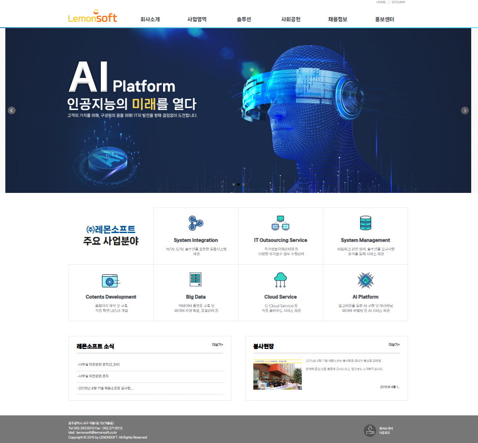
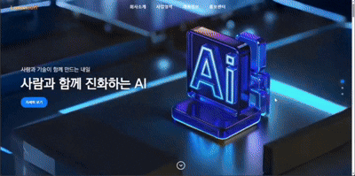
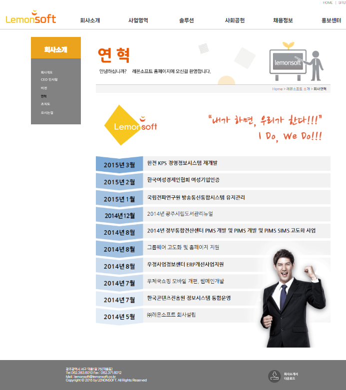
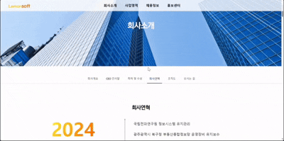
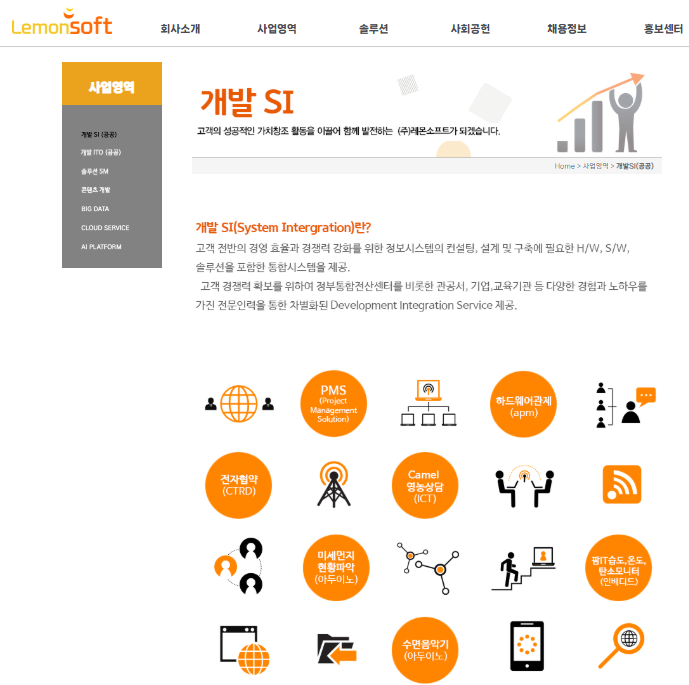
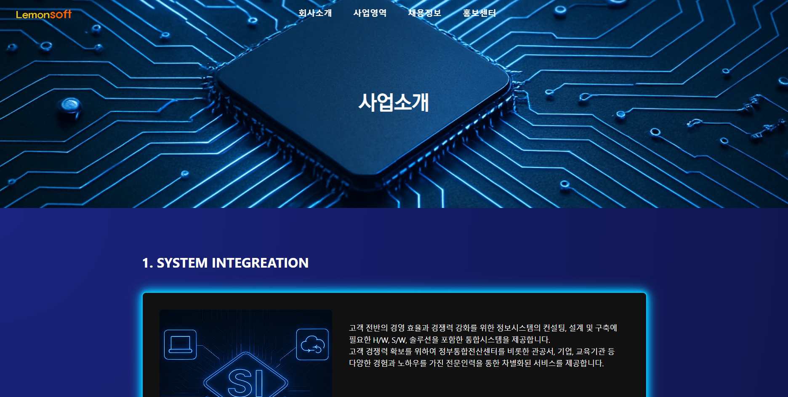
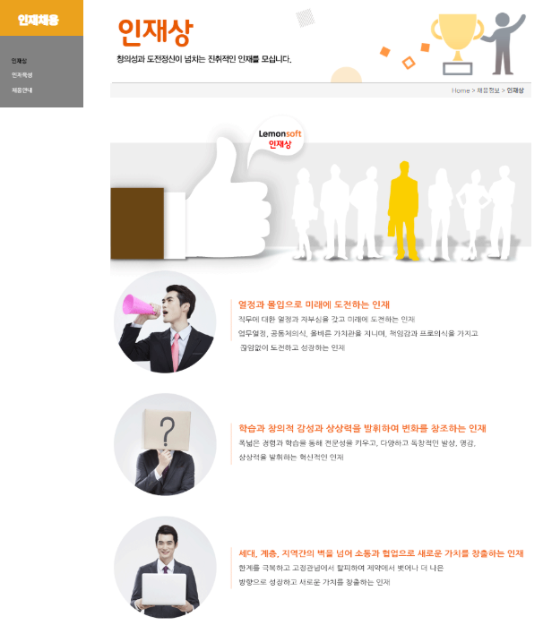
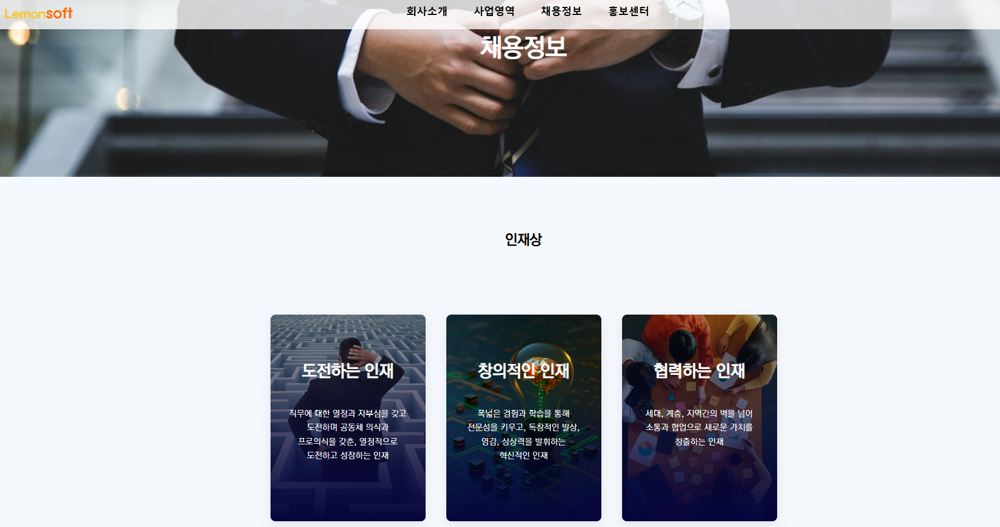
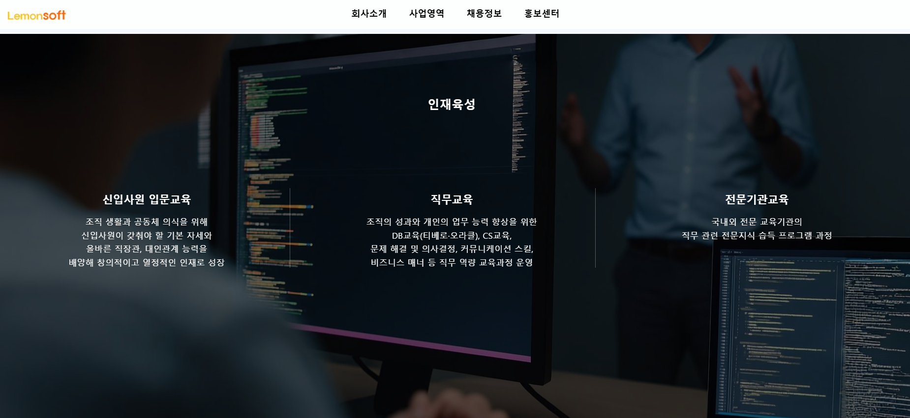
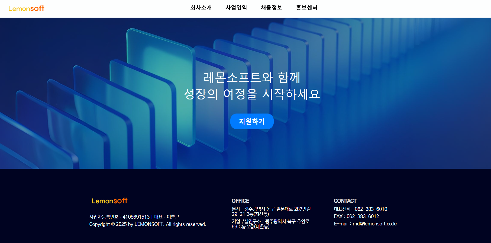

# 🍋 Lemonsoft 기업 홈페이지 리뉴얼

> 오래되고 미흡한 UI/UX를 개선하여 사용자 친화적이고 신뢰감 있는 기업 이미지를 구현한 단독 프로젝트

---

## 📌 프로젝트 개요

| 항목 | 내용 |
|------|------|
| 목적 | 오래된 UI/UX, 레이아웃 구조 개선 → 사용자 친화적·신뢰감 있는 기업 이미지 제공 |
| 기여도 | 1명 100% (기획, 디자인, 개발 전 과정 단독 진행) |
| 기간 | 총 4주 (초기 개발 2주 + 디자인 전면 재구성 및 재개발 2주) |
| 페이지 수 | 메인, 회사소개, 사업영역, 채용정보, 홍보센터 (총 5개) |
| 구성 섹션 | 약 25개 (네비게이션 바, 탭 UI, 이미지 갤러리, 공지 리스트 등) |
| 형상관리 | GitHub 커밋 53회 |

---

## 🛠️ 사용 기술

| 분류 | 기술 |
|------|------|
| Frontend | HTML5, CSS3, Vanilla JS |
| Backend | Node.js, Express.js |
| 버전관리 | Git, GitHub |

---

## 🔍 벤치마킹

IT·기술 분야 10개 이상 실제 기업 웹사이트 분석 후 핵심 UX/UI 패턴 도출

| 사이트 | 참고 포인트 | 적용 방식 |
|--------|------------|----------|
| 솔트룩스 | 연도별 연혁 스크롤 인터랙션 | `IntersectionObserver`로 연도 고정 및 내용 전환 구현 |
| 현대오토에버 | 패럴럭스 비주얼 중심 섹션 | 메인 슬라이드 구조 및 패럴럭스 효과 구현 |
| 롯데이노베이터 | 글라스모피즘 + 미니멀 UI | 글라스모피즘 UI와 무한 스크롤 리스트 적용 |

---

## 🪄 개선 전 → 개선 후

| Before | After |
|--------|-------|
|  |  |
|  |  |
|  |  |
|  |  |
| |  |
| |  |
---

## 🖐🏻 역할 및 구현

### 1. 레퍼런스 조사 및 초기 셋업
- 10개 기업 홈페이지 비교·분석(1일) → 핵심 UI/UX 패턴 도출
- 디자인 툴 없이 **최초 프로토타입을 2시간 내** HTML/CSS/JS로 구현
- 1차 화면을 **당일 중** 시연하여 빠른 피드백 반영
- Node.js(Express) + nodemon 개발 서버 구축, GitHub 레포지토리 연동

### 2. 페이지 레이아웃 구현

**메인**
- 슬라이더 화면과 슬라이드 인디케이터 개발
- 회사 대표 기술을 무한 슬라이드로 구현 (마우스 오버 시 일시정지, 클릭 시 센터링)
- 회사 주요 제품 카드 컴포넌트 제작
- 패럴럭스 효과를 활용한 프로젝트 소개 섹션 구현

**회사소개**
- 탭 구조화: 회사 개요, CEO 인사말, 특허·수상, 회사 연혁, 조직도, 오시는 길을 탭 UI로 구성
- 회사 연혁: `IntersectionObserver` API로 스크롤 시 해당 연도 자동 강조 + 페이드인 효과
- 오시는 길: `roughmapLoader.js`로 탭 활성화 시점에 `render()` 함수로 지도 정확히 로드

**사업영역**
- 주요 서비스 카테고리를 카드 컴포넌트와 이미지로 구성

**채용정보**
- 인재상: 핵심 역량과 가치관을 카드 컴포넌트로 시각화
- 인재육성: `IntersectionObserver` + scroll 이벤트로 이미지 fade-in, 텍스트 slide-up 동기화
- 채용절차: 주요 단계를 아이콘으로 직관적으로 표현

**홍보센터**
- 탭 UI: 공지, 뉴스, 행사, 개편을 탭으로 구분 + 카테고리별 필터링
- JSON 데이터 기반 동적 리스트 렌더링
- 페이징 기능 구현

### 3. Git 버전 관리
- 회사에서 작업 후 git push → 퇴근 후 git pull → 추가 작업 반복
- 기능 단위 커밋과 간결한 메시지 작성으로 이력 관리

---

## 💫 트러블슈팅

### 1. 디자인 전면 변경 요구
**문제**: 인턴 2주차에 내부 검토에서 디자인 퀄리티 부족 피드백 수령. 2주밖에 남지 않은 상황에서 명확한 디자인 가이드 없이 전면 재구성 요청. 담당자 간 의견 충돌로 의사결정 지연

**해결**: 담당자와 직접 회의로 요구사항 정리 후 재설계. 퇴근 후 git pull로 추가 작업하며 시간 확보. 주말에 레퍼런스 조사 및 이미지 직접 제작으로 완성도 향상

---

### 2. CSS Sticky 속성 미작동
**문제**: 연혁 섹션에서 연도를 고정하기 위해 `position: sticky` 적용했으나 작동하지 않음

**해결**: 상위 요소의 `overflow-x: auto`가 sticky 동작을 방해함을 파악 → `overflow: visible`로 수정. `IntersectionObserver`와 scroll 이벤트를 병행해 연도와 내용 자연스럽게 동기화

---

### 3. 지도 렌더링 초기화 문제
**문제**: 탭 UI 전환 시 카카오맵 컴포넌트가 비정상 렌더링되며 빈 화면 출력

**해결**: 탭 전환에 따른 DOM 재렌더링 시점과 지도 초기화 타이밍 불일치 파악 → 탭 활성화 시 `render()` 함수 호출로 지도 재초기화

---

### 4. 스크롤 기반 인터랙션 동기화 문제
**문제**: 이미지와 텍스트 애니메이션이 서로 다른 시점에 작동해 시각적으로 어색함 발생

**해결**: `IntersectionObserver`로 뷰포트 진입 타이밍 정확히 감지. 이미지 fade-in, 텍스트 slide-up 애니메이션 동기화. 지연시간·지속시간 조정으로 자연스러운 전환 구현

---

### 5. 로고 색상으로 인한 디자인 문제
**문제**: 회사 로고의 노랑·주황 색상이 미래지향적 IT 웹페이지 디자인과 조화 어려움

**해결**: IT 기업 레퍼런스 조사 후 보라·남색·검정·파랑 계열을 메인 컬러로, 주황·노랑을 포인트 색상으로만 사용하는 배색 전략 수립. 브랜드 아이덴티티는 살리면서 전체 분위기와 균형 유지

---

## ✨ 회고

### 개발이 적성에 맞는다는 확인
- 힘들지만 즐겁게 일할 수 있었고 문제 해결 과정 자체에 몰입하며 개발이 잘 맞는다는 확신을 얻음
- 퇴근 후에도 자연스럽게 레이아웃을 구상하고 코드 개선을 고민하는 자신을 발견

### 역량 부족 자각과 학습 방향 전환
- JavaScript 지식 부족으로 기능 구현에서 자주 막히는 경험
- 단순 암기형 공부보다 실무·프로젝트 중심 학습으로 전략 전환 필요성 자각

### 실무 습관의 중요성
- 이미지 파일을 폴더 없이 root에 넣거나 JS/CSS 파일 중복 등 비효율적인 구조 경험
- 이후 페이지 단위 구조화 + 주석 처리 + 파일 분리 원칙 수립

### 향후 학습 계획
- **TypeScript**: 타입 시스템 이해
- **React / Vue.js**: 컴포넌트 기반 UI 개발
- **Next.js**: SSR 및 API 핸들링
